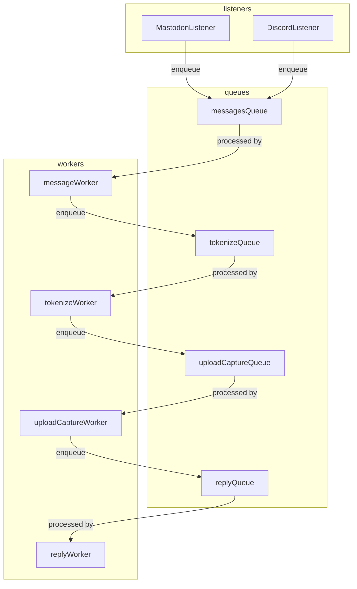

# real-c64-bot

## Description

A bot to execute BASIC code, received in messages from a variety of sources,
on a real Commodore 64, capture the results, and post the video back as a
reply to the original message.

Heavy inspiration is taken from [BBC Micro Bot](https://www.bbcmicrobot.com).

The C64 is controlled by an [1541 Ultimate II+](https://www.ultimate64.com/) cartridge, which is just about the
slickest piece of hardware I've come across.

## Concepts

* Listeners stream in messaages from their respective sources (Mastodon, Discord... pigeons) and enqueue them,
* A chain of workers handle the message:
    * Code is extracted from the message and tokenized (using [petcat](https://vice-emu.sourceforge.io/vice_16.html) from the [VICE](https://vice-emu.sourceforge.io/vice_16.html) project)
    * The tokenized code is uploaded to the C64 (using the Ultimate's FTP capabilities)
    * Video capture is started, and the code is executed (using the Ultimate's Telnet remote control features)
        * Video capture is handled by a Raspberry Pi 4 with a USB CVBS (composite) capture device (to be documented)
    * A reply is sent to the original source, with the video attached.

