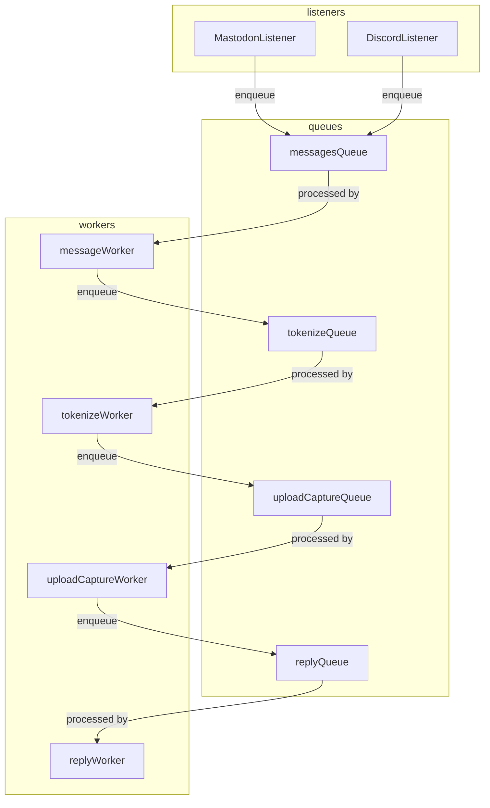

# real-c64-bot

## Description

A bot to execute BASIC code, received in messages from a variety of sources,
on a real Commodore 64, capture the results, and post the video back as a
reply to the original message.

## Concepts

* Listeners stream in messaages from their respective sources (Mastodon, Discord... pigeons) and enqueue them,
* A chain of workers handle the message:
    * Code is extracted from the message and tokenized
    * The tokenized code is uploaded to the C64
    * Video capture is started, and the code is executed
    * A reply is sent to the original source, with the video attached

